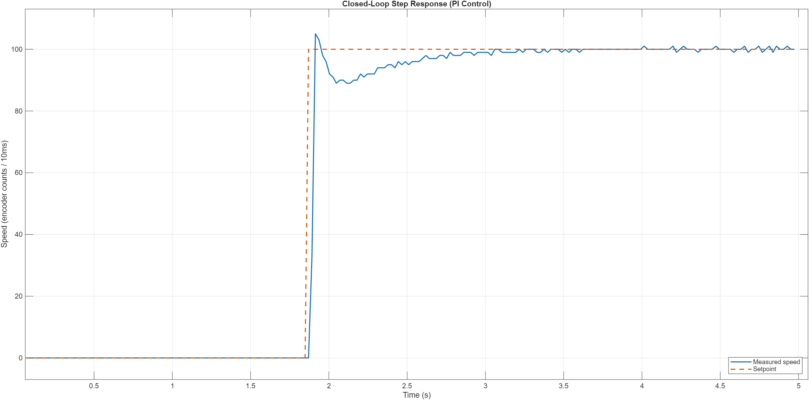

# Closed-Loop DC Motor Controller with ROS 2 Interface

A bare-metal STM32 motor controller implementing real-time PI speed control with
hardware quadrature encoder feedback, exposed to the ROS 2 ecosystem through a
serial bridge. Commanded and monitored over standard ROS 2 topics.


---

## What it does

A brushed DC gear motor is driven in a closed feedback loop: the microcontroller
measures actual shaft speed from a quadrature encoder, compares it to a commanded
setpoint, and continuously adjusts motor power (PWM) to hold the target speed; rejecting disturbances such as an externally applied load. The setpoint can be
commanded, and the live speed monitored, from ROS 2 using the `/cmd_vel` and
`/motor_state` topics.

Key behaviours demonstrated:

- Holds a commanded speed with zero steady-state error
- Rejects disturbances (applied load) and returns to setpoint automatically
- Runs the control law at a fixed, hardware-timed rate for deterministic behaviour
- Integrates into ROS 2 so the actuator is commandable by any ROS node

---

## System architecture

```
  ROS 2 (PC / WSL)                        STM32F746 (bare-metal HAL)              Power stage
  ---------------                         --------------------------              -----------
  ros2 topic pub  --> /cmd_vel  --.
                                   \        UART (115200)            PWM 20 kHz
  motor_bridge node  <------------- >  <----------------->  [ PI control loop ] ----------> [ L298N ] --> [ DC motor ]
                                   /                          @ 100 Hz (TIM4)                  H-bridge         |
  ros2 topic echo <-- /motor_state'                                ^                                            | encoder
                                                                   |  quadrature counts (TIM3)                  |
                                                                   +--------------------------------------------+
```

- **STM32** runs the entire control loop standalone; it does not depend on the PC to function.
- **ROS 2 bridge** is a thin Python translator: ROS topics <-> serial. The firmware is unchanged whether driven from ROS or a plain serial terminal.

---

## Results

### Closed-loop step response (PI control)



| Metric              | Value |
| ------------------- | ----- |
| Rise time (10–90%)  | 22 ms |
| Overshoot           | 5 %   |
| Settling time (±2%) | 0.9 s |
| Steady-state error  | 0     |

Fast rise from the proportional term, a small controlled overshoot, and clean
settling to the setpoint with no residual offset.

### P-only vs PI: steady-state error


The same motor under an identical 0→setpoint step, with and without the integral
term. Proportional control alone settles well below the target (the classic
steady-state error) because proportional action produces output only in
proportion to the _present_ error. Adding the integral term accumulates the
persistent error over time and drives it to zero. Both traces are measured on
hardware.

---

## How it works

### Speed sensing: hardware quadrature decoding

The motor's magnetic encoder produces two 90°-offset channels (A/B). Rather than
counting edges in software (which misses pulses at speed), a general-purpose timer
(**TIM3**) is configured in **encoder mode**, decoding direction and position in
hardware with zero CPU load. Speed is derived as the change in count per fixed
time step.

### Motor drive: 20 kHz PWM

An advanced-control timer (**TIM1**) generates a **20 kHz PWM** signal on one
channel, above the audible range to avoid switching whine while keeping motor
current smooth. Duty cycle (the compare register, CCR) sets speed; two GPIO lines
set direction via the L298N H-bridge. PWM frequency is fixed by the timer's
auto-reload value; speed is varied at runtime through the compare value.

### Control loop: fixed-rate PI in a timer interrupt

The PI controller runs inside a **100 Hz timer interrupt (TIM4)**, not the main
loop, so every iteration represents an exactly equal time step. This matters:
the integral and derivative terms are only mathematically valid at a fixed `dt`.
Each cycle: read encoder → compute speed → compute error → update PI terms →
clamp and apply PWM + direction.

Tuned gains: **Kp = 100, Ki = 4, Kd = 0** (a PI controller; derivative was
unnecessary and would amplify encoder noise).

### Anti-windup

When a commanded speed exceeds the motor's physical maximum, the integral term
would otherwise accumulate unbounded ("windup"), causing a large delayed surge
when the setpoint drops. This is prevented with **conditional integration**, the
integral only accumulates when the output is not saturated; plus a magnitude
clamp as a secondary bound. Commanded setpoints are also clamped to the motor's
achievable range.

### Serial telemetry and command

The firmware streams `time,setpoint,speed` over UART and accepts a numeric
setpoint over the same link (interrupt-driven receive). This same interface is
what the ROS 2 bridge speaks to.

### ROS 2 bridge

A `rclpy` node subscribes to `/cmd_vel` (relaying commands to the STM32 over
serial) and publishes measured speed to `/motor_state` (read from the STM32's
telemetry stream). The publisher and subscriber connect the serial link to ROS
in opposite directions; the topics decouple the motor from whatever commands it,
so any ROS node (joystick, planner, navigation stack) can drive it unchanged.

---

## Hardware

| Component      | Part                                                                          |
| -------------- | ----------------------------------------------------------------------------- |
| MCU board      | NUCLEO-F746ZG (STM32F746ZG, Cortex-M7)                                        |
| Motor          | Waveshare N20 DC gear motor, 12 V, magnetic Hall encoder (1050 PPR at output) |
| Motor driver   | L298N dual H-bridge                                                           |
| Motor supply   | 12 V DC adapter (2 A)                                                         |
| Encoder supply | 3.3 V from the Nucleo                                                         |

### Wiring summary

| Signal      | STM32 pin | Board label   | Connects to |
| ----------- | --------- | ------------- | ----------- |
| Encoder A   | PA6       | D12           | Encoder C1  |
| Encoder B   | PC7       | D21           | Encoder C2  |
| PWM (speed) | PE9       | D6            | L298N ENA   |
| Direction 1 | PF13      | D7            | L298N IN1   |
| Direction 2 | PF14      | D4            | L298N IN2   |
| UART TX/RX  | PD8/PD9   | (ST-LINK VCP) | PC over USB |

Common ground shared between STM32, L298N, and the 12 V supply. Encoder powered
at 3.3 V so its A/B logic levels are directly MCU-safe.

---

## Repository structure

```
.
├── firmware/        STM32CubeIDE project (bare-metal HAL, PI control loop)
├── ros2_bridge/     motor_bridge.py  — rclpy node bridging ROS 2 <-> serial
├── analysis/        MATLAB scripts + captured CSV logs for the plots
├── docs/            architecture diagram, plots, demo GIF
└── README.md
```

---

## Running it

### Firmware

Open `firmware/` in STM32CubeIDE, build, and flash to the NUCLEO-F746ZG.

### Plain serial (no ROS)

Open the ST-LINK virtual COM port at **115200** baud in any serial terminal.
Telemetry streams as `time,setpoint,speed`; type a number + Enter to set the speed.

### ROS 2 (Humble)

```bash
# Share the board into WSL (Windows host), then in WSL:
python3 ros2_bridge/motor_bridge.py

# In another terminal:
ros2 topic echo /motor_state                                   # watch speed
ros2 topic pub --once /cmd_vel std_msgs/msg/Float32 "{data: 80.0}"   # command speed
```
